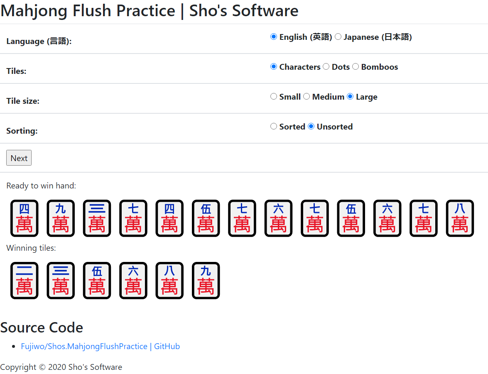

# Shos.MahjongFlushPractice

[English](README.md) | 日本語

麻雀 清一色の練習 (Mahjong Flush Practice) は、清一色の待ちを当てる練習用のブラウザアプリです。1 種類の牌だけで構成された 13 枚の聴牌形がランダムに出題されるので、和了牌となる待ちをすべて選んで答えます。

## 公開ページ

* [麻雀 清一色の練習 | 翔ソフトウェア (Sho's)](https://www.shos.info/doc/chiniisou.html "Mahjong Flush Practice | Sho's Software")



## 機能

* **七対子を含む和了判定**: 4 面子 1 雀頭の形に加えて七対子も和了形として判定します。答えには、和了形になる待ちがすべて表示されます。
* **使用する牌の切り替え**: 萬子・筒子・索子から選べます。
* **フォント / 画像表示**: 牌を Unicode の麻雀牌文字で描画するか、GIF 画像で描画するかを選べます。フォントで正しく表示されない場合は「画像」を選んでください。
* **牌の大きさ**: 小・中・大から選べます。
* **理牌のあり / なし**: 手牌を並べ替えて表示するか、バラバラの順で表示するかを選べます。
* **日本語 / 英語 UI**: 初期状態ではブラウザの言語設定に従い、画面上で切り替えられます。
* **設定の保存**: 上記の表示設定はブラウザの `localStorage` に保存され、次回アクセス時に復元されます。
* **正解数の表示**: 答え合わせをした問題数と、そのうちの正解数を表示します。

## 使い方

1. ページを開くと、ボタンの下に聴牌形が出題されます。
2. 「何待ち?」の 1〜9 のチェックボックスで、待ちだと思う牌をすべてチェックします。「クリア」でチェックをすべて外せます。
3. 「待ちを表示」を押すと、手牌の下に正解の待ちが表示されます。チェックが待ちと完全に一致した場合だけ正解となり、正解数が更新されます。
4. 「次の問題」を押すと、新しい問題が出題されます。

表示設定はいつでも変更でき、表示中の手牌にすぐ反映されます。

## 開発

### 必要環境

* [Node.js](https://nodejs.org/) (npm を含む)

### ビルド

```sh
npm install
npm run build
```

`npm run build` は次の 2 つの処理を順に実行します (それぞれ単独でも実行できます)。

* `npm run build:ts`: TypeScript で `chiniisou.ts` をコンパイルし、`chiniisou.js` (と `chiniisou.js.map`) を生成します。
* `npm run build:min`: terser で `chiniisou.js` から `chiniisou.min.js` を、clean-css で `chiniisou.css` から `chiniisou.min.css` を生成します。

> **注意:** `chiniisou.html` が読み込むのは `chiniisou.min.js` と `chiniisou.min.css` で、圧縮前のファイルではありません。`chiniisou.ts` や `chiniisou.css` を変更したら、必ず `npm run build` を実行してください。実行しないと変更がページに反映されません。

### ローカルでの起動

リポジトリのルートを HTTP で配信し、`chiniisou.html` を開きます。例:

```sh
npx http-server -p 8080
```

ブラウザで <http://localhost:8080/chiniisou.html> を開きます (`.vscode/launch.json` には `http://localhost:8080` 向けの Chrome デバッグ構成があります)。

jQuery と Bootstrap は CDN から読み込むため、インターネット接続が必要です。なお、ヘッダーや区切り線の画像 (`../css/image/line.jpg`) とナビゲーションのリンクは公開先の Web サイト上のファイルを参照しており、このリポジトリには含まれていません。

## ファイル構成

| ファイル | 説明 |
| --- | --- |
| `chiniisou.html` | ページ本体 |
| `chiniisou.ts` | アプリケーションの全ロジック (TypeScript ソース) |
| `chiniisou.css` | スタイルシート |
| `chiniisou.js`, `chiniisou.js.map` | コンパイル後の JavaScript とソースマップ (生成物) |
| `chiniisou.min.js`, `chiniisou.min.css` | ページが読み込む圧縮済みファイル (生成物) |
| `images/` | 画像表示モードで使う牌の画像 |
| `package.json`, `tsconfig.json` | ビルドスクリプトと TypeScript の設定 |

## 作者情報

Fujio Kojima: 日本のソフトウェア開発者
* Microsoft MVP for Development Tools - Visual C# (Jul. 2005 - Dec. 2014)
* Microsoft MVP for .NET (Jan. 2015 - Oct. 2015)
* Microsoft MVP for Visual Studio and Development Technologies (Nov. 2015 - Jun. 2018)
* Microsoft MVP for Developer Technologies (Nov. 2018 - Jun. 2027)
* [MVP プロフィール](https://mvp.microsoft.com/en-US/mvp/profile/4185d172-3c9a-e411-93f2-9cb65495d3c4 "MVP Profile")
* [ブログ](https://wp.shos.info "Blog (Japanese)")
* [Web サイト](https://www.shos.info "Web Site (Japanese)")

## ライセンス

MIT License の下で公開しています。
