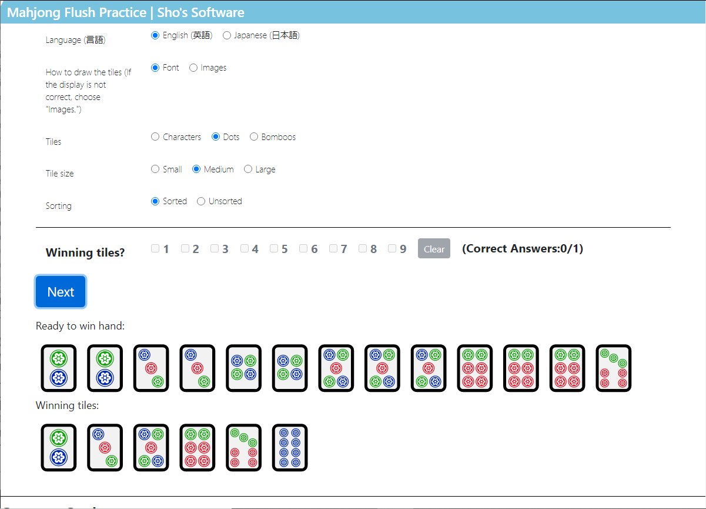

# Shos.MahjongFlushPractice

## Sample Page
* [Mahjong Flush Practice | Sho's Software](https://www.shos.info/doc/chiniisou.html "Mahjong Flush Practice | Sho's Software")

## Author Info

Fujio Kojima: a software developer in Japan
* Microsoft MVP for Development Tools - Visual C# (Jul. 2005 - Dec. 2014)
* Microsoft MVP for .NET (Jan. 2015 - Oct. 2015)
* Microsoft MVP for Visual Studio and Development Technologies (Nov. 2015 - Jun. 2018)
* Microsoft MVP for Developer Technologies (Nov. 2018 - Jun. 2021)
* [MVP Profile](https://mvp.microsoft.com/en-us/PublicProfile/21482 "MVP Profile")
* [Blog (Japanese)](http://wp.shos.info "Blog (Japanese)")
* [Web Site (Japanese)](http://www.shos.info "Web Site (Japanese)")

## License

This library is under the MIT License.
